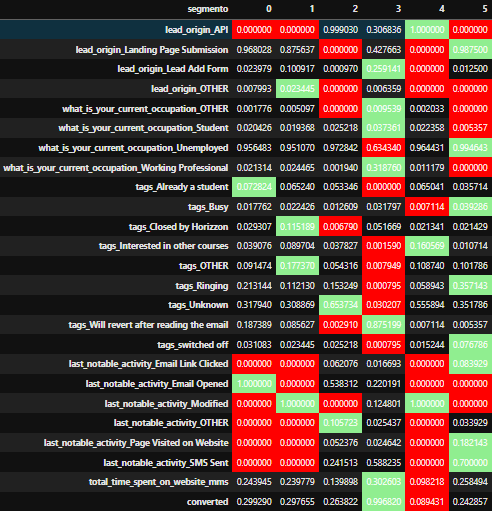
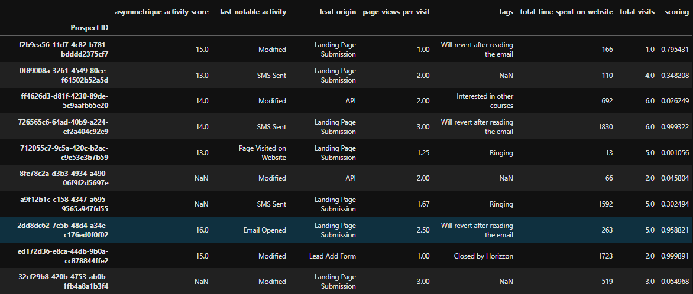

# 📈 Lead Scoring: Segmentación y probabilidad de compra de cursos online 
### *Perfil y Scoring de leads con KMeans y Logistic Regression*

---

## Problema

Las empresas invierten en marketing, generan leads y terminan con más leads de los que pueden gestionar mediante su equipo comercial.

La calidad de los leads baja, no todos los leads van a estar tan interesados en comprar.

Esto requiere de un tipo de solución que ayude a identificar dentro de todo el volumen de leads a los que estén más interesados y priorizarlos.

## Solución
- Modelización con Machine Learning para asignar una puntuación (scoring) según la probabilidad de conversión.
- Implementación de Machine Learning no supervisado para entender mejor el tipo de leads que se están capturando y dar recomendaciones de consultoría.

## Resultados
- Incremento drástico en las tasas de conversión.
- Priorización de leads de alta calidad.
- Optimización del uso de recursos de marketing.
- Automatización de todo el proceso listo para producción.

## Demo

  

  <em>Perfil de leads.</em>

  

  <em>Scoring de leads.</em>

